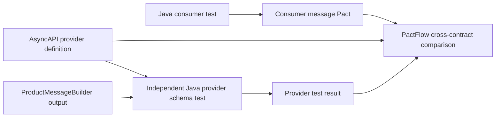

# Demonstrating async bi-directional contract testing

[asyncapi.json](asyncapi.json) is a provider-owned AsyncAPI 3.0 definition based on
`ProductEvent`, `EventType`, and `ProductMessageBuilder`. It can be opened in an
AsyncAPI-compatible documentation viewer. It documents the `products` channel,
the `sendProductEvent` operation, and a JSON product lifecycle event.

The Java setup is implemented: the V4 consumer generates its operation reference,
and `ProductAsyncApiTest` independently validates the producer. The local demo
script runs without Kafka, Spring startup, or PactFlow credentials. Publishing
commands later in this guide write to your PactFlow tenant.

## Quick customer-call demo

Run these commands from the repository root. Rehearse once before the call to
warm the Gradle cache and download dependencies.

```bash
bash bdct-demo.sh baseline
bash bdct-demo.sh broken-provider
bash bdct-demo.sh provider
```

| Command | What to say | Expected result |
| --- | --- | --- |
| `baseline` | “Our consumer processes its expected event; our producer independently meets its AsyncAPI schema.” | Consumer passes; operation reference is checked; four provider tests pass. |
| `broken-provider` | “The provider documentation now requires productName, but the implementation still sends name.” | Three schema tests fail with a required `productName` violation; command exits nonzero intentionally. |
| `provider` | “We are checking the original contract again.” | All four provider tests pass again. |

The failure command creates `build/bdct/asyncapi-breaking.json`; it does not edit
Java source or `asyncapi.json`. This demonstrates **provider implementation drift**.
It is not PactFlow's cross-contract comparison. For the full BDCT story, use steps
6–9 below to publish real test results and demonstrate a provider that passes its
own schema but fails compatibility with the unchanged consumer.

To run only the consumer, use `bash bdct-demo.sh consumer`. To show the provider
report, open `provider-java-kafka/build/reports/tests/test/index.html` after a run.
Each provider run replaces that report, so show the failure before recovery.

## Explain the two workflows



The existing `ProductsKafkaProducerTest` loads the consumer Pact and calls
`verifyInteraction()`. That demonstrates consumer-driven provider verification.
For BDCT, an independent provider test must validate actual message-builder output
against the AsyncAPI message schema without loading a consumer Pact.

## Contract choices

- `sendProductEvent` uses `action: send` because this document describes the producer.
- `products` matches the topic configured in `ProductMessageBuilder`.
- `id` is a string, not a UUID: the provider fixture uses `id1`.
- `event` permits the three values in `EventType`.
- `price` is optional and nullable, matching the nullable Java `Double` and allowing
  the existing consumer example to omit it.
- The five core fields are required and non-null for this demo. These are intended
  contract requirements, not guarantees enforced by the current Java class.
- Spring's internal message headers are not declared as Kafka wire headers here.
  The builder's topic and content-type metadata should be checked separately in
  the provider test. This definition does not claim Kafka delivery guarantees.

## 1. Prepare the terminal

Use Bash or zsh. Start at the repository root and keep the same terminal throughout
the demo. You need the JDK that already runs this workshop, Node.js/npm, Python 3,
Docker running, and a PactFlow tenant with AsyncAPI BDCT support and a write token.

```bash
export BDCT_ROOT="$PWD"
export PACT_BROKER_BASE_URL="https://YOUR-TENANT.pactflow.io"
export PACT_BROKER_TOKEN="YOUR-WRITE-TOKEN"
export BDCT_CONSUMER="pactflow-example-consumer-java-kafka-V4"
export BDCT_PROVIDER="pactflow-example-provider-java-kafka"
export BDCT_BRANCH="bdct-demo"
export BDCT_RUN="$(date -u +%Y%m%dT%H%M%SZ)"
export BDCT_CONSUMER_VERSION="${BDCT_RUN}-consumer"
export BDCT_PROVIDER_VERSION="${BDCT_RUN}-provider-baseline"

docker pull pactfoundation/pact-cli:latest

pact_cli() {
  docker run --rm \
    -v "$BDCT_ROOT:/work" -w /work \
    -e PACT_BROKER_BASE_URL -e PACT_BROKER_TOKEN \
    pactfoundation/pact-cli:latest "$@"
}

pact_cli pactflow publish-provider-contract --help
```

The publishing help must support `--specification asyncapi`. Demo version suffixes
distinguish local experiments; in CI, use versions identifying the exact source
and artifacts tested, usually a Git commit. Keep the token out of source control.

## 2. Validate and show the AsyncAPI document

```bash
cd "$BDCT_ROOT"
npx --yes --package @asyncapi/cli asyncapi validate provider-java-kafka/asyncapi.json
```

Expected: no validation errors. Documentation-quality warnings may be reported.
This validates the specification's structure, not your Java producer.

Optionally, in a second terminal, show it in AsyncAPI Studio:

```bash
npx --yes --package @asyncapi/cli asyncapi start studio provider-java-kafka/asyncapi.json
```

Show `products`, `operations.sendProductEvent`, `action: send`, and the event schema.
See the [AsyncAPI CLI reference](https://www.asyncapi.com/docs/tools/cli/usage).

## 3. Java consumer setup (already implemented)

[ProductsPactTestV4.java](../consumer-java-kafka/src/test/java/io/pactflow/example/kafka/ProductsPactTestV4.java)
uses Pact JVM 4.7.5's V4 `addReference` API to write:

```json
{
  "comments": {
    "references": {
      "AsyncAPI": { "operationId": "sendProductEvent" }
    }
  }
}
```

The test deserializes the example, calls the real `ProductEventListener`, and
verifies that the product is saved through a mocked repository. It does not start
Spring or Kafka. The operation ID matches the AsyncAPI operation key, separately
from the interaction description used in consumer-driven provider verification.

## 4. Independent provider test (already implemented)

[ProductAsyncApiTest.java](src/test/java/io/pactflow/example/kafka/ProductAsyncApiTest.java)
uses `com.networknt:json-schema-validator:1.5.9`, declared in `build.gradle`.
It reads `asyncapi.json` and validates real `ProductMessageBuilder` output for
CREATED, UPDATED, and DELETED. It checks topic/content-type metadata and includes
a negative test proving a missing ID is rejected. No consumer Pact is loaded.

The test-side validator uses Jackson 2; application serialization uses Jackson 3.
The serialized JSON string is the boundary. Draft 7 validation covers the keywords
in this simple payload schema; step 2 validates the entire AsyncAPI document.
An optional `BDCT_SCHEMA_FILE` environment variable selects an alternate document
for the local failure demo. The normal default is `asyncapi.json`.

## 5. Generate and inspect the consumer contract

```bash
cd "$BDCT_ROOT/consumer-java-kafka"
./gradlew clean test --tests 'io.pactflow.example.kafka.ProductsPactTestV4'
```

Expected: a passing consumer test and a fresh V4 Pact. `clean` removes old build
output so interactions from earlier experiments are not merged into this demo.
This V4 test does not need Kafka or an application server.

Check the reference and exact names before publishing:

```bash
cd "$BDCT_ROOT"
python3 - <<'PY'
import json
import os
from pathlib import Path

files = list(Path("consumer-java-kafka/build/pacts").glob("*.json"))
assert len(files) == 1, f"Expected one freshly generated V4 Pact, got {files}"
pact = json.loads(files[0].read_text())
assert pact["consumer"]["name"] == os.environ["BDCT_CONSUMER"]
assert pact["provider"]["name"] == os.environ["BDCT_PROVIDER"]
assert pact["interactions"], "No interactions generated"
for interaction in pact["interactions"]:
    assert interaction["type"] == "Asynchronous/Messages"
    assert interaction["comments"]["references"]["AsyncAPI"]["operationId"] == "sendProductEvent"
print("Ready to publish:", files[0])
PY
```

Expected: `Ready to publish`. A missing reference means the V4 generation code or generated contract needs checking.

## 6. Test and publish the provider's AsyncAPI contract

Define this helper in the original terminal. It captures the actual Gradle exit
code and log for each provider version, then publishes that result with the schema.
It publishes failures too, so a failed build is never reported as successful.

```bash
verify_and_publish_provider() {
  local result_dir="$BDCT_ROOT/provider-java-kafka/build/bdct/$BDCT_PROVIDER_VERSION"
  local test_exit
  mkdir -p "$result_dir"

  if (cd "$BDCT_ROOT/provider-java-kafka" && \
      BDCT_SCHEMA_FILE="$BDCT_ROOT/provider-java-kafka/asyncapi.json" \
      ./gradlew test --tests 'io.pactflow.example.kafka.ProductAsyncApiTest' \
        --rerun-tasks --console=plain) > "$result_dir/provider-test.log" 2>&1; then
    test_exit=0
  else
    test_exit=$?
  fi
  cat "$result_dir/provider-test.log"
  cp "$BDCT_ROOT/provider-java-kafka/asyncapi.json" "$result_dir/asyncapi.json"

  pact_cli pactflow publish-provider-contract \
    "provider-java-kafka/build/bdct/$BDCT_PROVIDER_VERSION/asyncapi.json" \
    --provider "$BDCT_PROVIDER" \
    --provider-app-version "$BDCT_PROVIDER_VERSION" \
    --branch "$BDCT_BRANCH" \
    --specification asyncapi \
    --content-type application/json \
    --verification-exit-code "$test_exit" \
    --verification-results "provider-java-kafka/build/bdct/$BDCT_PROVIDER_VERSION/provider-test.log" \
    --verification-results-content-type text/plain \
    --verifier "JUnit5-networknt-json-schema" || return $?

  return "$test_exit"
}

verify_and_publish_provider
```

Expected: four passing tests (three enum cases plus the missing-ID negative test)
and a successful provider-contract publication. Do not edit the schema while this
function is running. If tests or publishing fail, resolve the error before moving on.

## 7. Publish the consumer and show the baseline comparison

```bash
pact_cli pact-broker publish consumer-java-kafka/build/pacts \
  --consumer-app-version "$BDCT_CONSUMER_VERSION" \
  --branch "$BDCT_BRANCH"

pact_cli pact-broker can-i-deploy \
  --pacticipant "$BDCT_CONSUMER" --version "$BDCT_CONSUMER_VERSION" \
  --pacticipant "$BDCT_PROVIDER" --version "$BDCT_PROVIDER_VERSION" \
  --retry-while-unknown 12 --retry-interval 5
```

Expected: the exact consumer/provider version pair is compatible. Open the links
printed by the CLI and show the AsyncAPI cross-contract result, along with the
provider's independent test result. If the result is unknown, check publication,
names, operation references, and availability of AsyncAPI support in the tenant.

This compares two explicitly selected versions; it does not record a deployment.
No shared demo environment needs to be created or changed. Production pipelines
also use environment-based `can-i-deploy` and record actual deployments.

PactFlow validates the concrete message example and metadata against AsyncAPI;
Pact matchers are ignored for this comparison. Topic names must match. See the
[AsyncAPI comparison rules](https://support.smartbear.com/swagger/contract-testing/docs/en/user-guide/contract-testing/bi-directional-contract-testing/supported-contracts/asyncapi/features-testing-asyncapi.html)
and [publishing flags](https://support.smartbear.com/swagger/contract-testing/docs/en/user-guide/contract-testing/bi-directional-contract-testing/publishing-contracts.html).

## 8. Show a breaking change: rename name to productName

Keep the consumer unchanged. First save the two provider files you will edit:

```bash
mkdir -p "$BDCT_ROOT/provider-java-kafka/build/bdct/backups/$BDCT_RUN"
cp "$BDCT_ROOT/provider-java-kafka/asyncapi.json" \
  "$BDCT_ROOT/provider-java-kafka/build/bdct/backups/$BDCT_RUN/asyncapi.json"
cp "$BDCT_ROOT/provider-java-kafka/src/main/java/io/pactflow/example/kafka/ProductEvent.java" \
  "$BDCT_ROOT/provider-java-kafka/build/bdct/backups/$BDCT_RUN/ProductEvent.java"
```

In `ProductEvent.java`, annotate the existing `name` field:

```java
@com.fasterxml.jackson.annotation.JsonProperty("productName")
private String name;
```

In `asyncapi.json`, make these three edits:

1. Rename `components.schemas.ProductEvent.properties.name` to `productName`.
2. Replace `name` with `productName` in that schema's `required` list.
3. Rename `name` to `productName` in the example payload.

Keep Java constructor arguments unchanged; the annotation changes JSON serialization.
Do not rename the message's own `name` property or change the consumer test.
Then validate, test, and publish under a new provider version:

```bash
cd "$BDCT_ROOT"
npx --yes --package @asyncapi/cli asyncapi validate provider-java-kafka/asyncapi.json
export BDCT_PROVIDER_VERSION="${BDCT_RUN}-provider-breaking"
verify_and_publish_provider
```

Expected: provider tests still pass because its implementation matches its updated
schema. Compare the same consumer version against this new provider version:

```bash
pact_cli pact-broker can-i-deploy \
  --pacticipant "$BDCT_CONSUMER" --version "$BDCT_CONSUMER_VERSION" \
  --pacticipant "$BDCT_PROVIDER" --version "$BDCT_PROVIDER_VERSION" \
  --retry-while-unknown 12 --retry-interval 5
```

Expected: nonzero exit status and an incompatible result. In PactFlow, show the
consumer example lacking the now-required `productName`. The provider independently
passes its own contract, yet breaks the consumer's expectations.

If only the Java annotation or only the schema is changed, the provider schema test
should fail instead. That demonstrates implementation drift, a different failure.

## 9. Restore the baseline and show recovery

Restore only the two files changed during step 8. Do not run a provider `clean`
until after restoration: the backups are under its build directory.

```bash
cp "$BDCT_ROOT/provider-java-kafka/build/bdct/backups/$BDCT_RUN/asyncapi.json" \
  "$BDCT_ROOT/provider-java-kafka/asyncapi.json"
cp "$BDCT_ROOT/provider-java-kafka/build/bdct/backups/$BDCT_RUN/ProductEvent.java" \
  "$BDCT_ROOT/provider-java-kafka/src/main/java/io/pactflow/example/kafka/ProductEvent.java"

export BDCT_PROVIDER_VERSION="${BDCT_RUN}-provider-restored"
verify_and_publish_provider

pact_cli pact-broker can-i-deploy \
  --pacticipant "$BDCT_CONSUMER" --version "$BDCT_CONSUMER_VERSION" \
  --pacticipant "$BDCT_PROVIDER" --version "$BDCT_PROVIDER_VERSION" \
  --retry-while-unknown 12 --retry-interval 5
```

Expected: passing provider tests and a compatible pair again. Published demo versions
remain in PactFlow, providing the baseline/breaking/restored history for presentation.

## Troubleshooting

| Symptom | Check |
| --- | --- |
| No annotated method for an interaction | You ran the old consumer-driven provider test. Use `ProductAsyncApiTest` for this BDCT demo. |
| Duplicate class or public class filename error | Ensure an IDE backup such as `ProductsKafkaProducerTest copy.java` is not saved as a second Java source under `src/test/java`. Gradle compiles all test sources even when filtering one test. |
| Unknown AsyncAPI operation | Confirm the V4 Pact reference exactly matches `sendProductEvent`. |
| Provider result is failed | Inspect the version-specific `build/bdct/.../provider-test.log`; do not override its exit code. |
| Missing product ID breaks the consumer | Restore the valid consumer fixture before presenting the baseline. |
| Baseline payload comparison fails | Check the concrete example, required fields, JSON content type, and topic in PactFlow's details. |

The local Java tests and failure/recovery commands can be rehearsed without an
account. PactFlow publication and cross-contract results still require a rehearsal
against your tenant before the call.
